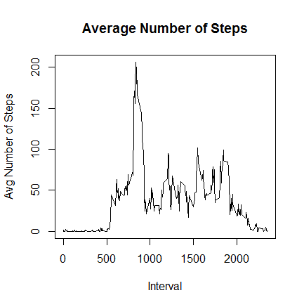

##Loading and preprocessing the data
1. Download a copy of the data : [Activity Monitoring Data](https://d396qusza40orc.cloudfront.net/repdata%2Fdata%2Factivity.zip) Data was downloaded on 6 May 2014.

2. Unzip and load the data which is in csv format. 

3. Data exploration


```r
data <-read.csv("activity.csv")
head(data)
```

```
##   steps       date interval
## 1    NA 2012-10-01        0
## 2    NA 2012-10-01        5
## 3    NA 2012-10-01       10
## 4    NA 2012-10-01       15
## 5    NA 2012-10-01       20
## 6    NA 2012-10-01       25
```

```r
summary(data)
```

```
##      steps                date          interval     
##  Min.   :  0.00   2012-10-01:  288   Min.   :   0.0  
##  1st Qu.:  0.00   2012-10-02:  288   1st Qu.: 588.8  
##  Median :  0.00   2012-10-03:  288   Median :1177.5  
##  Mean   : 37.38   2012-10-04:  288   Mean   :1177.5  
##  3rd Qu.: 12.00   2012-10-05:  288   3rd Qu.:1766.2  
##  Max.   :806.00   2012-10-06:  288   Max.   :2355.0  
##  NA's   :2304     (Other)   :15840
```

##What is mean total number of steps taken per day. 

1. Total number of steps taken per day


```r
totalsteps<- aggregate(steps ~ date, data , sum)
```
2. Plot a histogram of the number of steps taken per day


```r
library(ggplot2)
ggplot(totalsteps, aes(x = date, y = steps)) + 
       geom_histogram(fill = "blue", binwidth = 10, stat="identity") + 
        labs(title="Total Steps Taken per Day", 
             x = "Date", y = "Total Steps")+
  theme(axis.text.x = element_text(angle = 80, hjust = 1, size = 8))
```

 
3. Calculate and report the mean and median of the total number of steps taken per day

```r
mean(totalsteps$steps)
```

```
## [1] 10766.19
```


```r
median(totalsteps$steps)
```

```
## [1] 10765
```
##What is the average daily pattern

1. Make a time series plot of the 5-minute interval (x-axis) and the average number of steps taken, averaged across all days (y-axis)


```r
intervalsteps <- aggregate( steps ~interval, data, mean)

plot(intervalsteps$interval,intervalsteps$steps, type="l", xlab="Interval", ylab="Avg Number of Steps",main="Average Number of Steps")
```

 

2. Which 5-minute interval, on average across all the days in the dataset, contains the maximum number of steps


```r
max_interval <- intervalsteps[which.max(intervalsteps$steps),1]
```

##Imputing missing values

1. Calculate and report the total number of missing values in the dataset 

```r
missing <- sum(is.na(data$steps))
```

2. Imput missing value using mean of intervals and create a new dataset


```r
revalues <- data.frame(data$steps)
revalues[is.na(revalues),] <- ceiling(tapply(X=data$steps,INDEX=data$interval,FUN=mean,na.rm=TRUE))
newdata <- cbind(revalues, data[,2:3])
colnames(newdata) <- c("Steps", "Date", "Interval")
head(newdata
     )
```

```
##   Steps       Date Interval
## 1     2 2012-10-01        0
## 2     1 2012-10-01        5
## 3     1 2012-10-01       10
## 4     1 2012-10-01       15
## 5     1 2012-10-01       20
## 6     3 2012-10-01       25
```

3. Calculate total number of steps for each day


```r
totalsteps2<- aggregate(Steps ~ Date, newdata , sum)
```
4. Plot a histogram of the number of steps taken per day


```r
library(ggplot2)
ggplot(totalsteps2, aes(x = Date, y = Steps)) + 
       geom_histogram(fill = "blue", binwidth = 10, stat="identity") + 
        labs(title="Total Steps Taken per Day with Imputed Value", 
             x = "Date", y = "Total Steps")+
  theme(axis.text.x = element_text(angle = 80, hjust = 1))
```

 

5. Calculate and report the mean and median of the total number of steps taken per day

```r
mean(totalsteps2$Steps)
```

```
## [1] 10784.92
```


```r
median(totalsteps2$Steps)
```

```
## [1] 10909
```

Imputing the missing values result in a higher mean and median in the total number of steps taken per day. 

##Are there differences in activity patterns between weekdays and weekends

1. Create a new factor variable in the dataset with two levels - "weekday" and "weekend" 


```r
DayType <- data.frame(sapply(X = newdata$Date, FUN = function(day) {
    if (weekdays(as.Date(day)) %in% c("Monday", "Tuesday", "Wednesday", "Thursday", 
        "Friday")) {
        day <- "weekday"
    } else {
        day <- "weekend"
    }
}))

data2<-  cbind(newdata, DayType)
colnames(data2) <- c("Steps", "Date", "Interval", "DayType")
head(data2)
```

```
##   Steps       Date Interval DayType
## 1     2 2012-10-01        0 weekday
## 2     1 2012-10-01        5 weekday
## 3     1 2012-10-01       10 weekday
## 4     1 2012-10-01       15 weekday
## 5     1 2012-10-01       20 weekday
## 6     3 2012-10-01       25 weekday
```

2. Make a panel plot containing a time series plot (i.e. type = "l") of the 5-minute interval (x-axis) and the average number of steps taken, averaged across all weekday days or weekend days (y-axis).


```r
intervalstepsday<- aggregate( data=data2,Steps ~ DayType + Interval,  FUN=mean)
head(intervalstepsday)
```

```
##   DayType Interval     Steps
## 1 weekday        0 2.2888889
## 2 weekend        0 0.2500000
## 3 weekday        5 0.5333333
## 4 weekend        5 0.1250000
## 5 weekday       10 0.2888889
## 6 weekend       10 0.1250000
```

```r
library(lattice)
xyplot(
    type="l",
    data=intervalstepsday,
    Steps ~ Interval | DayType,
    xlab="Interval",
    ylab="Avg Number of Steps",
    layout=c(1,2))
```

 
